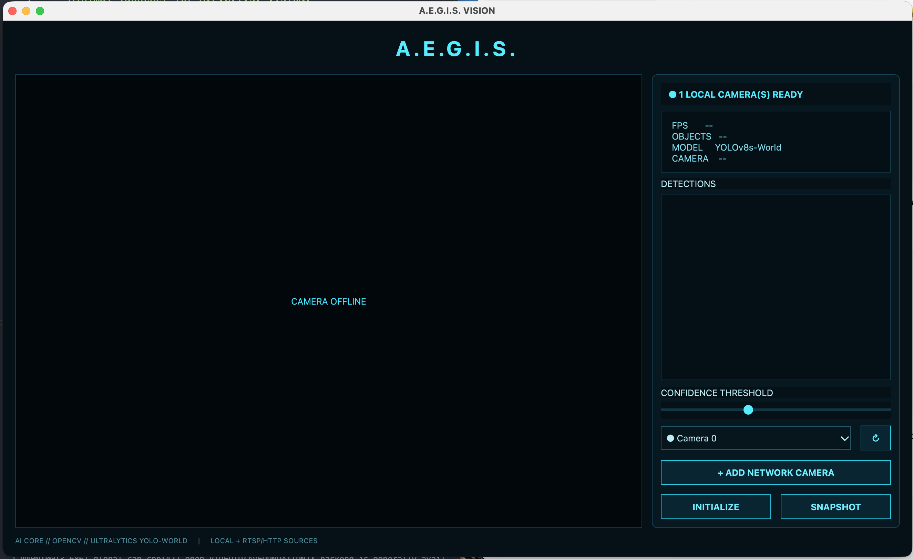
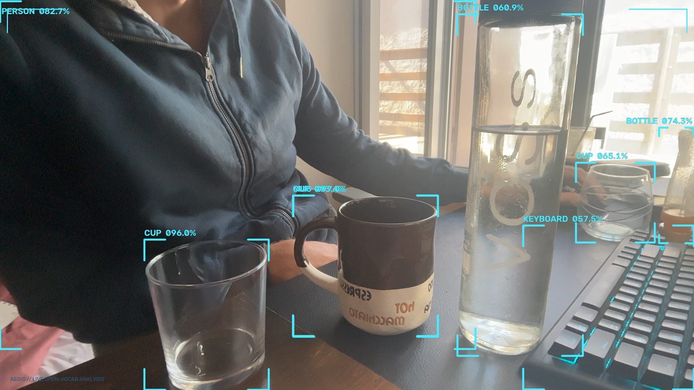

# A.E.G.I.S.

<p align="center">
  <strong>Advanced Environmental &amp; General Intelligence Scanner</strong>
</p>

<p align="center">
  Real-time open-vocabulary object detection with a futuristic computer-vision HUD.
</p>

<p align="center">
  
  
  
  
  
</p>

---

## About

**A.E.G.I.S.** is a Python desktop computer-vision application designed for real-time object detection through live camera feeds.

It combines **OpenCV**, **Ultralytics YOLO-World**, and **PySide6** with a custom futuristic HUD. Instead of displaying raw model output, A.E.G.I.S. presents detections through a clean cyan interface with corner brackets, object labels, confidence scores, system information, and camera controls.

## A.E.G.I.S. Interface

<p align="center">
  
</p>

<p align="center">
  <em>The A.E.G.I.S. desktop interface for camera control, live detections, and system monitoring.</em>
</p>

## Object Detection in Action

<p align="center">
  
</p>

<p align="center">
  <em>Real-time open-vocabulary object detection with the A.E.G.I.S. vision HUD.</em>
</p>

## Features

- Real-time object detection
- Open-vocabulary detection using YOLO-World
- Custom futuristic HUD visualization
- Large, readable object labels and confidence scores
- Adjustable confidence threshold
- Automatic scanning for available local camera inputs
- Camera rescan functionality
- RTSP / HTTP network-stream support
- Live FPS and object counters
- Detection list with confidence values
- Snapshot capture
- macOS and Windows launchers
- Cross-platform Python architecture

## Technology

A.E.G.I.S. is built with **Python**, **OpenCV**, **Ultralytics YOLO-World**, **PySide6 / Qt**, and **NumPy**.

## Installation

### Requirements

- Python **3.10+** recommended
- A webcam, USB camera, compatible Continuity Camera, or network video stream
- Internet access on the first run if model weights need to be downloaded

### Clone the repository

```bash
git clone https://github.com/JohnBourmpoulas/AEGIS-VISION.git
cd AEGIS-VISION
```

### macOS

Use the included launcher:

```bash
chmod +x start_mac.command
./start_mac.command
```

Or install manually:

```bash
python3 -m venv .venv
source .venv/bin/activate
python -m pip install --upgrade pip
python -m pip install -r requirements.txt
python run.py
```

On first use, macOS may request camera permission. Allow access for the terminal or application used to launch A.E.G.I.S.

For later launches:

```bash
source .venv/bin/activate
python run.py
```

### Windows

Use the included launcher:

```bat
start_windows.bat
```

Or install manually:

```bat
python -m venv .venv
.venv\Scripts\activate
python -m pip install --upgrade pip
python -m pip install -r requirements.txt
python run.py
```

## Camera Sources

A.E.G.I.S. scans for camera inputs exposed by the operating system. Depending on the computer and OS, these can include built-in webcams, USB cameras, external cameras exposed as standard video devices, compatible Continuity Camera devices on macOS, and RTSP / HTTP network streams added manually.

Use the camera selector inside the application to switch between discovered sources. The **Rescan** function can be used after connecting or disconnecting a camera.

> Not every Wi-Fi or Bluetooth camera automatically appears as a standard video device. Network-camera support depends on the protocols and stream URLs provided by the camera.

## Object Detection

A.E.G.I.S. uses **YOLO-World** for open-vocabulary object detection. Example detections may look like:

```text
PERSON        92.4%
MOBILE PHONE  87.1%
BOTTLE        84.7%
GLASSES       76.3%
```

The **Confidence Threshold** determines the minimum confidence required for a detection to be displayed. Raising it filters lower-confidence predictions; it does **not** increase the underlying model's accuracy or guarantee that a classification is correct.

## Model Weights

Pretrained model files such as `*.pt` should not be committed to the repository. A.E.G.I.S. can obtain the required model through the Ultralytics workflow when necessary, keeping the repository smaller and easier to maintain.

## Project Structure

```text
AEGIS-VISION/
├── aegis/
│   ├── __init__.py
│   └── app.py
├── assets/
│   ├── aegis-interface.png
│   └── aegis-detection-demo.png
├── run.py
├── requirements.txt
├── start_mac.command
├── start_windows.bat
├── .gitignore
├── LICENSE
└── README.md
```

## Known Limitations

Object-detection results are probabilistic. Accuracy can be affected by lighting, camera quality, viewing angle, object size, occlusion, motion blur, and visual similarity between objects.

The model may occasionally misclassify an object, miss an object, produce different classifications across consecutive frames, or assign high confidence to an incorrect prediction. Confidence scores represent model confidence, not a guarantee of correctness.

Camera discovery also depends on the operating system, drivers, and the way a device exposes its video stream.

## Roadmap

- Persistent object tracking and stable IDs
- Temporal detection smoothing
- Improved class consistency between frames
- Configurable detection vocabulary
- Video recording
- Detection history and event logging
- Additional HUD visualization modes
- Apple Silicon / GPU performance optimization
- More advanced network-camera discovery

## Privacy

A.E.G.I.S. processes video from camera sources supplied to the application. Users are responsible for ensuring that camera use, recordings, network streams, and computer-vision processing comply with applicable privacy rules, permissions, and laws.

## License

A.E.G.I.S. is released under the **MIT License**. See the [`LICENSE`](LICENSE) file for details.

## Acknowledgements

A.E.G.I.S. is built on the Python computer-vision ecosystem and makes use of **OpenCV**, **Qt / PySide6**, and **Ultralytics YOLO-World**.

---

<p align="center">
  <strong>A.E.G.I.S.</strong><br>
  Advanced Environmental &amp; General Intelligence Scanner<br><br>
  <em>Detect • Identify • Analyze</em>
</p>
